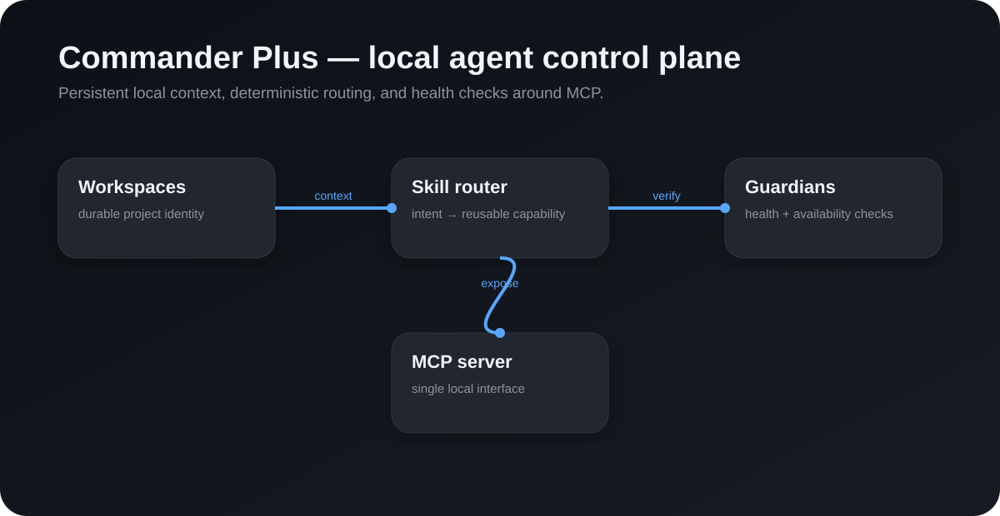

# Commander Plus

A small, local-first MCP control-plane core for AI agents that need persistent project context without sending workstation state to a hosted orchestration service.

This public repository contains the safe reference layer: workspace registration, reusable skill routing and health guardians. Production-only desktop automation, authenticated browser control, private relay infrastructure and local operational data are intentionally not included.

## Why it exists

Most agent demos are stateless. Commander Plus treats the workstation as a durable execution environment: projects have identities, skills can be routed by intent, and health checks make local state explicit.

## Included

- MCP server over stdio
- Persistent local workspace registry
- Reusable skill registry and deterministic intent routing
- Workspace health guardian
- JSON storage under a configurable local application directory
- Node test coverage for routing behavior

## Run

1. Install dependencies with npm install.
2. Build with npm run build.
3. Start with npm start.

Set COMMANDER_PLUS_HOME to move the local state directory.

## Architecture

Client -> MCP server -> workspace / skill / guardian services -> local JSON state

The public core is intentionally conservative. It does not expose shell execution, private browser sessions, credentials, customer data or machine-specific paths.

## Public vs private boundary

Public: local control-plane primitives, MCP interface, routing model, tests and documentation.

Private: production browser bridge, privileged desktop automation, private plugins, relays, operational logs, local databases and deployment configuration.

## Security

Treat any workstation-control plugin as privileged software. Review tool scopes before enabling write or execution capabilities. Never commit local state, environment files or credentials.
